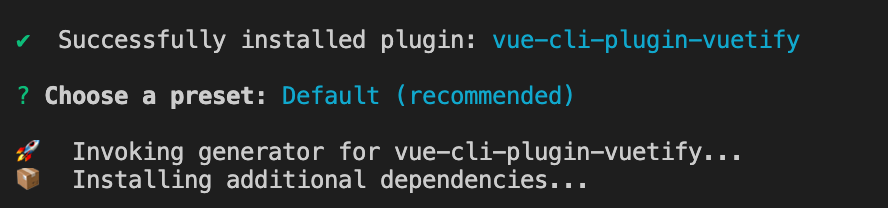
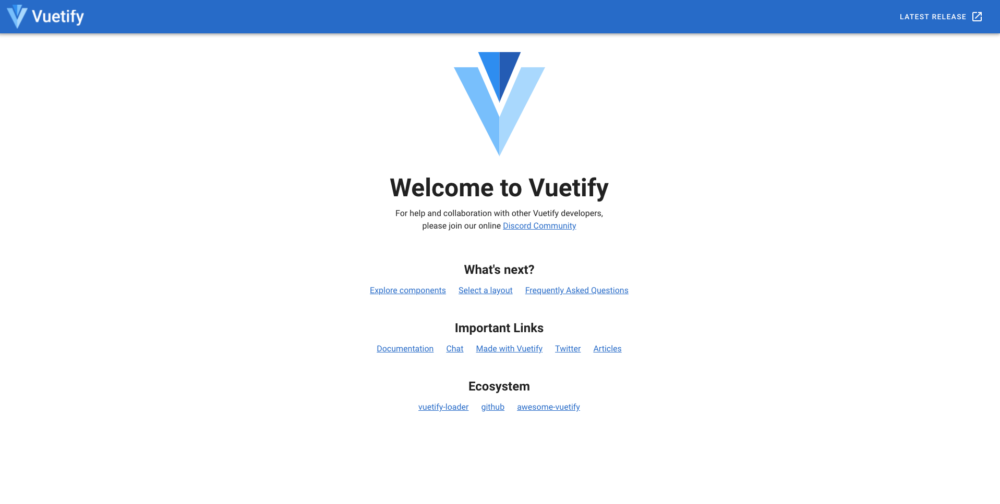
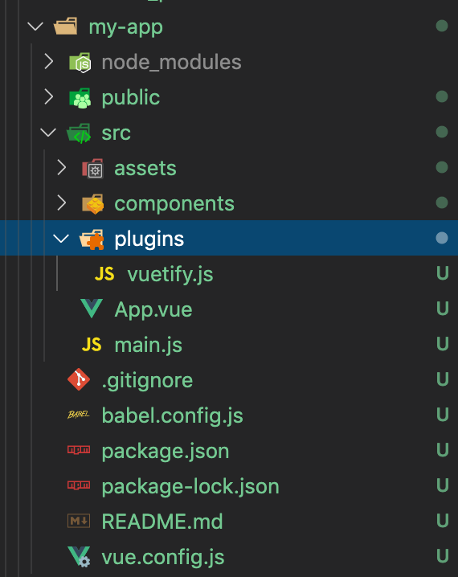

# Vuetify入门教程
## Vuetify是什么
Vuetify是基于Vue.js的UI组件库。 是遵循谷歌倡导的[Material Design specification](https://material.io/design)，高质量组件。说白了，Vuetify提供了现成的各种组件，即使没有设计方面的知识，也可以非常简单的(通过复制粘贴)来实现炫酷的UI。[官网](https://vuetifyjs.com/zh-Hans/getting-started/quick-start/)提供了非常详细的说明。

## 使用Vuetify创建第一个项目
前提:本地安装好vue-cli环境。

1. 创建普通的vue项目

```shell
$ vue create my-app
$ cd my-app
```

2. 安装vuetify包
```shell
$ vue add vuetify
```

安装时被问到是否使用默认配置，直接回车选择默认。


3. 启动项目
```shell
$ npm run serve
```
访问http://localhost:8080/，可以看到Vuetify的欢迎画面。 


这时观察项目结构，跟普通的vue项目不同的是有一个`src/plugins/vuetify.js`。它注册Vuetify，并在`src/main.js`中被配置。


```js
// vuetify.js
import Vue from 'vue';
import Vuetify from 'vuetify/lib';

Vue.use(Vuetify);

export default new Vuetify({
});
```

```js
// main.js
new Vue({
  vuetify,
  render: h => h(App)
}).$mount('#app')
```

## 现在我们尝试修改第一个项目
首先我们搞定导航栏跟标题栏。我们要做的仅仅是复制，然后修改，或者删除。比如我们可以
[复制这个标题栏](https://codepen.io/pen/?&editable=true&editors=101=https%3A%2F%2Fvuetifyjs.com%2Fzh-Hans%2Fcomponents%2Fapp-bars%2F)
然后自己改改颜色，字体等等。这时候应该怎么办？去看API。API中的props,slot等，让你能够自定义组件。比如v-app-bar中提供了color属性，可以改变颜色。颜色又可以在这里找[颜色地址](https://vuetifyjs.com/zh-Hans/styles/colors/)。这里我们找到了一下的颜色并指定给了标题栏。

```js
blue darken-3
```

## 详细了解一下标题栏

### 标题栏`v-app-bar`
- `v-app-bar`必须被`v-app`包裹。否则很多属性不生效。
- `app`属性指定该组件作为应用程序布局的一部分。用于动态调整内容的大小。
> 在 Vuetify 中，v-app组件和v-navigation-drawer、v-app-bar、v-footer等组件上的app属性会在您的应用程序启动时帮助<v-main>组件获得正确的大小。
- `dark`属性，颜色开启dark模式。字体配色会自动改变，深色背景字体会自动变白色。
- `v-app-bar-nav-icon`：专门为 v-toolbar 和 v-app-bar 创建的图标按钮组件。通常作为汉堡包菜单出现在工具栏的左侧，它通常用于控制导航抽屉的状态。default 插槽可以用来定制这个组件的图标和功能。比如使用`<v-icon>`来自定义图标。
- `v-toolbar-title`用来定义标题栏的标题。

## 详细了解一下导航栏

### 导航栏`v-navigation-drawer`
- `v-navigation-drawer`必须被`v-app`包裹。否则很多属性不生效。
- `app`属性指定该组件作为应用程序布局的一部分。用于动态调整内容的大小。
- `v-model`设置为true时显示导航栏，false不显示。
- `right`属性，如果不指定，则默认在左边。
- `v-list`列表通常与导航栏配合使用。

### 列表`v-list`
使用`v-list`可以轻松的生成列表。可以
- `v-list-item`是列表项。有各种属性。
- `v-list-item-group`可以把列表项变成组，实现选中状态的UI
- `v-list-item-icon`表示列表项的图标。
- `v-list-item-content`是列表的内容，内容又分为1行，2行，3行。1行指定`v-list-item-title`,2行指定`v-list-item-subtitle`,3行指定``

### 可展开列表`v-list-group`
- 使用`v-list-group`可以在列表中生成展开列表。
- value属性（或者v-model指令）控制展开列表的打开或关闭。
- 每个展开列表都是`v-list`的列表项。每个展开列表内有一个`v-list-item-title`跟复数个`v-list-item`。
- `v-list-item-title`需要被`<template v-slot:activator>`包裹。`activator`是`v-list-group`的具名插槽，指定后的title点击就可以展开子列表。


### 每个`v-list-group`选中高亮问题
由于各个group的展开项是互相分离的，一个选中其他解除高亮需要程序自己控制。也就是控制`v-list-item`的`input-value`属性控制是否选中。

## 让我们开始编辑内容区

### 首先导入一个markdown插件
我们想在内容区显示一个markdown的文章。已经有一个优秀的markdown插件[mavonEditor](https://github.com/hinesboy/mavonEditor)。我们可以使用div标签插入，但是问题是层级需要调整z-index。

#### Install mavon-editor (安装)
```shell
$ npm install mavon-editor --save
```

#### 引入
main.js
```js

import Vue from 'vue'
import App from './App.vue'
import vuetify from './plugins/vuetify';

// 这里导入包mavonEditor
import mavonEditor from 'mavon-editor'
import 'mavon-editor/dist/css/index.css'

// 全局注册mavonEditor
Vue.use(mavonEditor)

Vue.config.productionTip = false

new Vue({
  vuetify,
  render: h => h(App)
}).$mount('#app')

```
在组件中使用
```js
<mavon-editor v-model="value"/>
```

### v-main,v-container编写内容区
分别使用div跟v-card来配置主文章，其他文章。


## 图标
使用这里的`https://materialdesignicons.com/cdn/2.0.46/`

