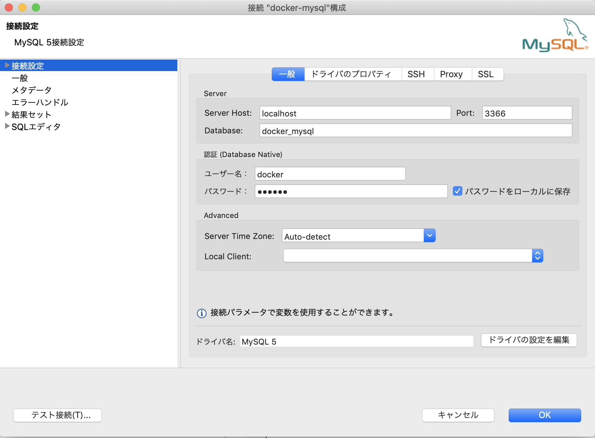
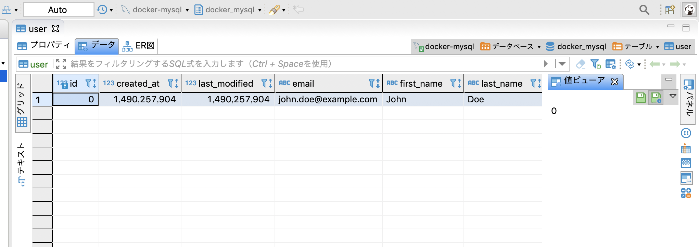

## 如何在EC2上创建实例并运行docker上的nginx-vue.js项目

### 0.准备工作：vue代码的根目录下生成dockerfile。并一起提交到github

[参考url](https://jp.vuejs.org/v2/cookbook/dockerize-vuejs-app.html)

以下是`dockerfile`的内容
```
# ビルド環境
FROM node:lts-alpine as build-stage
WORKDIR /app
COPY package*.json ./
RUN npm install
COPY . .
RUN npm run build

# 本番環境
FROM nginx:stable-alpine as production-stage
COPY --from=build-stage /app/dist /usr/share/nginx/html
EXPOSE 80
CMD ["nginx", "-g", "daemon off;"]
```


### 1.建立EC2的实例
按照该url介绍的步骤创建一个EC2的实例。
[参考url](https://qiita.com/minato-naka/items/c21e4d53db7a720f8fdd#ec2%E3%82%A4%E3%83%B3%E3%82%B9%E3%82%BF%E3%83%B3%E3%82%B9%E4%BD%9C%E6%88%90) 

注意开放端口80。并且配置私匙，比如mykey.pem用于本地ssh连接。

#### 1.1安装git, docker
进入到EC2管理控制台，安装git跟docker。
```shell
sudo yum install git
```

```shell
sudo yum install docker
```

### 2.从github上获取代码
进入到EC2管理控制台，并执行以下命令获取代码。
```shell
git clone xxx
```

### 3.启动docker
EC2管理控制台，进入dockerfile所在目录并执行以下命令。
```shell
# 启动docker
sudo service docker start

# 编译docker image
docker build -t vuejs-cookbook/dockerize-vuejs-app .

# 启动从起，映射EC2端口80到docker内的80
docker run -it -p 80:80 --rm --name dockerize-vuejs-app-1 vuejs-cookbook/dockerize-vuejs-app
```

输入```ss -atn```确认80端口开放。

```
[ec2-user@ip-172-31-23-8 ~]$ ss -atn
State              Recv-Q              Send-Q                            Local Address:Port                            Peer Address:Port              
LISTEN             0                   100                                   127.0.0.1:25                                   0.0.0.0:*                 
LISTEN             0                   128                                     0.0.0.0:111                                  0.0.0.0:*                 
LISTEN             0                   128                                   127.0.0.1:35729                                0.0.0.0:*                 
LISTEN             0                   128                                     0.0.0.0:22                                   0.0.0.0:*                 
ESTAB              0                   0                                   172.31.23.8:22                                3.16.146.0:3313              
LISTEN             0                   128                                        [::]:111                                     [::]:*                 
LISTEN             0                   128                                           *:80                                         *:*                 
LISTEN             0                   128                                        [::]:22                                      [::]:*   
```

### 4.确认网页
通过curl访问得到网页
```shell
[ec2-user@ip-172-31-23-8 ~]$ curl localhost
<!DOCTYPE html><html lang=en><head><meta charset=utf-8><meta http-equiv=X-UA-Compatible content="IE=edge"><meta name=viewport content="width=device-wi
dth,initial-scale=1"><link rel=icon href=/favicon.ico><title>my-app</title><link rel=stylesheet href="https://fonts.googleapis.com/css?family=Roboto:1
00,300,400,500,700,900"><link rel=stylesheet href=https://cdn.jsdelivr.net/npm/@mdi/font@latest/css/materialdesignicons.min.css><link href=/css/app.32
b9a1ba.css rel=preload as=style><link href=/css/chunk-vendors.3cfcfd82.css rel=preload as=style><link href=/js/app.3841af71.js rel=preload as=script><
link href=/js/chunk-vendors.d0b820aa.js rel=preload as=script><link href=/css/chunk-vendors.3cfcfd82.css rel=stylesheet><link href=/css/app.32b9a1ba.c
ss rel=stylesheet></head><body><noscript><strong>We're sorry but my-app doesn't work properly without JavaScript enabled. Please enable it to continue
.</strong></noscript><div id=app></div><script src=/js/chunk-vendors.d0b820aa.js></script><script src=/js/app.3841af71.js></script></body></html>[ec2-
user@ip-172-31-23-8 ~]$ 
```
或者从EC2管理控制台复制ip地址并从浏览器访问。


### 5.创建mysql容器
[参考url](https://blog.csdn.net/qq_42891915/article/details/90116190)
进入到mysql的dockerfile所在目录，执行编译命令
```
docker build . -t docker-mysql
```
参考。dockerfile内容
```
FROM mysql:5.7.20

#设置免密登录
ENV MYSQL_ALLOW_EMPTY_PASSWORD yes
    
#将所需文件放到容器中
COPY setup.sh /mysql/setup.sh
COPY schema.sql /mysql/schema.sql
COPY privileges.sql /mysql/privileges.sql
    
#设置容器启动时执行的命令
CMD ["sh", "/mysql/setup.sh"]
```

启动容器。指定容器名为mysql。映射端口号本机：docker都为3306
```
docker run -d -p 3366:3306 --name mysql docker-mysql 
```

连接容器
```
docker exec -it mysql sh
```

连接数据库
```shell
# 密码123456
# 连接mysql
mysql -u docker -p
# 切换数据库
use docker_mysql;
# 查看所有表
show tables;
# 查看用户表
select * from user;
```
使用DBeaver连接时的配置




===================
## 其他方便的操作
### 1.本地ssh连接
```
cd mykey.pem所在的目录
chmod 400 mykey.pem
ssh -i "mykey.pem" ec2-user@ec2-3-135-230-142.us-east-2.compute.amazonaws.com
```
主机名参考如下的【sshクライアント】


### 2.nginx的日志同步到EC2的目录下
启动时指定`-v`。把EC2本地设置好的default.conf跟容器同步，并把容器的nginx日志与EC2的本地同步
```
docker run -it -p 80:80 --rm --name dockerize-vuejs-app-1 -v ~/default.conf:/etc/nginx/conf.d/default.conf -v ~/access.log:/var/log/nginx/ vuejs-cookbook/dockerize-vuejs-app
```

### 3.nginx相关
- nginx设置文件目录
`/etc/nginx/`下。
- nginx改变设置后重新读取
```shell
nginx -s reload
```
- nginx日志位置
`/var/log/nginx`

### 4.解决路径直接输入造成404的问题
设置以下的内容，当用户请求 http://localhost/example 时，这里的 $uri 就是 /example。 
try_files 会到硬盘里尝试找这个文件。如果存在名为 /$root/example（其中 $root 是项目代码安装目录）的文件，就直接把这个文件的内容发送给用户。 
显然，目录中没有叫 example 的文件。然后就看 $uri/，增加了一个 /，也就是看有没有名为 /$root/example/ 的目录。 
又找不到，就会 fall back 到 try_files 的最后一个选项 /index.php，发起一个内部 “子请求”，也就是相当于 nginx 发起一个 HTTP 请求到 http://localhost/index.php。
[参考url1](https://blog.csdn.net/hanghangaidoudou/article/details/80817686)
[参考url2](https://www.cnblogs.com/boundless-sky/p/9459775.html)

```
location / {
  try_files $uri $uri/ /index.html;
}
```

### 5.传输EC2中的文件到本地
使用scp命令，并指定私钥。`scp -i [私钥] [EC2用户名]@[EC2域名]:[文件名] [下载到的目录名]`
```shell
$ sudo scp -i mykey.pem ec2-user@ec2-3-135-230-142.us-east-2.compute.amazonaws.com:~/default.conf ~/Desktop
```